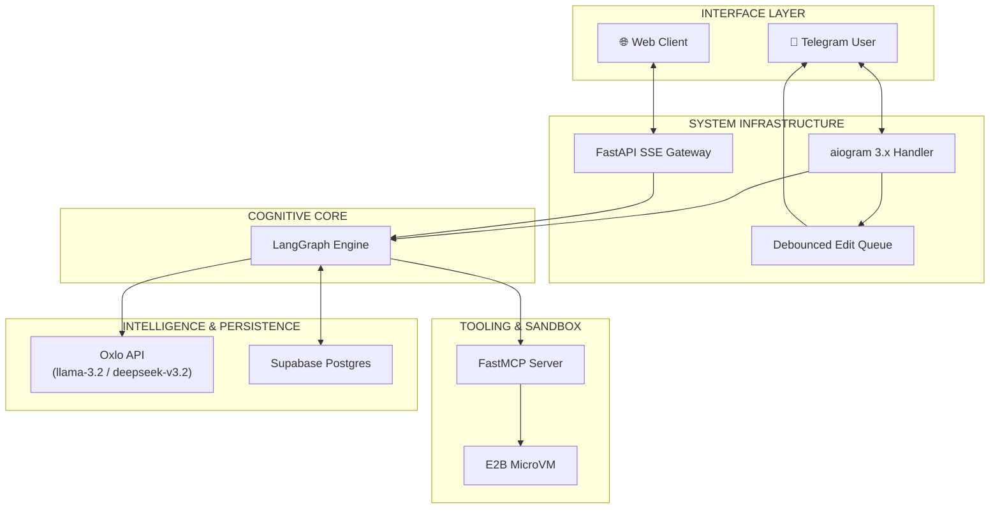
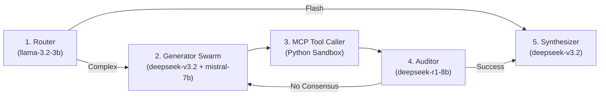

# 🛡️ Oxlo - Sentinel: God-Tier Cognitive AI Swarm

> **Tagline:** Deterministic, Auditable Reasoning through Swarm Intelligence and MCP Hardware Isolation.

---

## 🔎 Overview
**Oxlo - Sentinel** is a high-performance AI reasoning engine designed to solve the "Trust Opacity" problem in modern LLMs. While most AI bots provide "black-box" answers with no verifiable logic, Sentinel employs a **Cognitive Swarm** architecture—a multi-agent system that cross-audits logic, executes code in secure micro-VMs, and reaches a mathematical consensus before delivering a final answer.

## 🚀 Key Innovation: The Deterministic Swarm
Unlike standard bots, Sentinel does not "guess" math or logic. It follows a strict **"Code-First, Text-Second"** protocol:
1. **Parallel Hypothesis Generation**: Multiple models (`deepseek-v3.2`, `mistral-7b`) via the **Oxlo API** generate independent solutions simultaneously.
2. **MCP Hardware Isolation**: All logical claims are executed in a secure **E2B Python Sandbox** using the **Model Context Protocol (MCP)**.
3. **The Auditor (The Gatekeeper)**: A heavy-reasoning model (`deepseek-r1-8b`) audits the Sandbox output against the swarm's hypotheses. If they fail to align, the Auditor triggers a **Hivemind Debate**—forcing models to self-correct until consensus is reached.

---

## 🏗️ System Architecture
The system is built on four distinct layers to ensure institutional-grade performance and security:

1.  **Interface Layer (Telegram + FastAPI)**: Handles user interaction with a high-frequency **Debounced Edit Queue** for Telegram and **Server-Sent Events (SSE)** for the Web Command Center.
2.  **Cognitive Engine (LangGraph)**: A state-of-the-art acyclic graph that manages the multi-node reasoning flow, cycle counts, and state persistence.
3.  **Tooling Layer (MCP + E2B)**: Uses the **Model Context Protocol** to bridge the AI to secure micro-VMs, enabling safe code execution.
4.  **Intelligence Layer (Oxlo API)**: The heartbeat of the swarm, providing low-latency access to **Llama-3.2-3B** (Router) and **DeepSeek-V3.2** (Generator).

---

## 🧠 AI Reasoning Architecture (The Logic Flow)
The Sentinel Hivemind follows a 5-node cognitive cycle:

*   **Node 1: Router**: Classifies intent into "Flash" (Chat) or "Complex" (Reasoning) paths.
*   **Node 2: Divergent Generator**: Fires the swarm models in parallel using `asyncio.gather`.
*   **Node 3: MCP Tool Caller**: The "Hands" of the AI—executes Python scripts in the sandbox.
*   **Node 4: Auditor**: The "Brain"—performs the final logical audit and controls the debate loop.
*   **Node 5: Synthesizer**: The "Voice"—composes the final human-centric verified answer.

---

## 🛠️ Tech Stack
- **Orchestration**: LangGraph (Python)
- **Model Gateway**: Oxlo API (Llama, DeepSeek, Mistral)
- **Tooling Interface**: MCP (Model Context Protocol)
- **Code Execution**: E2B Secure Python Sandbox
- **Persistence**: Supabase (PostgreSQL + Vector Memory)
- **UX**: aiogram 3.x (Live Terminal Streaming)

---

## 🏆 Competitive Advantage
- **Auditable Logic**: Users get a `[SYSTEM TRACE]` showing exactly how the machine arrived at the answer.
- **Hardware-Level Truth**: Replaces generative hallucinations with deterministic code execution.
- **Scalable MCP Structure**: Using MCP allows us to add new tools (Search, Database, API access) to all swarm models instantly without rewriting integration code.
